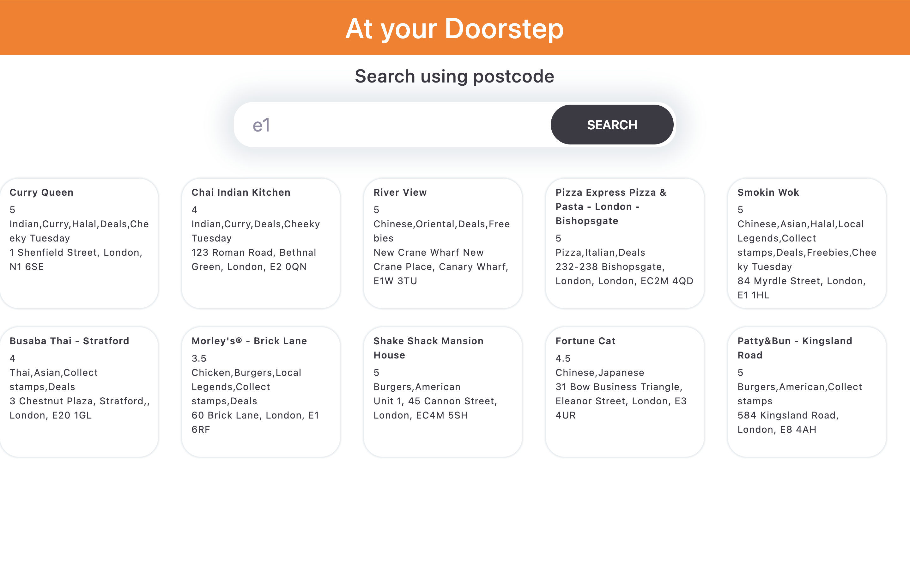

# Restaurant by Postcode

## Requirement

A web application that finds restaurants with a UK postcode using the Just Eat API. By entering a postcode we show 10 restaurants with name, cuisine, rating and address.

---

## How to Run

**Requirements:** Node.js installed.

```bash
# Clone the repository
git clone https://github.com/ShruthiKennedy/restaurant-by-postcode.git
cd restaurant-by-postcode

# Install dependencies
npm install

# Start the development server
npm run dev

# To run unit tests
npm test
```

Open the URL shown in the terminal (usually `http://localhost:5173`).

Try any of these postcodes: `SW1A 1AA`, `EC4M 7RF`, `WC2N 5DU`

Final page should look like below

## Preview



---

## Assumptions

- Rating is taken from `rating.starRating` which is a number.
- Address is formed by joining `firstLine`, `city`, and `postalCode` from the address object.
- Only the first 10 results are shown.
- Only the `name` field from each cuisine object is displayed.

---

## Improvements I Would Make

- Add sorting and filtering so users can filter by rating, location or cuisine.
- Add pagination or infinite scroll to show more records and allow the user to search.
- Cache already fetched data for postcodes to avoid making muliple network calls for the same postcode.
- Add toast to show errors in the application.
- Use libraries or typescript to validate response JSON schema.
- Add loading skeleton cards instead of a plain text loading message.
- Make the UI responsive for different screen sizes.

## Challenges Faced

- The Just Eat API does not allow direct browser request due to CORS restrictions. To tacle this I used Vite proxy server.
-
